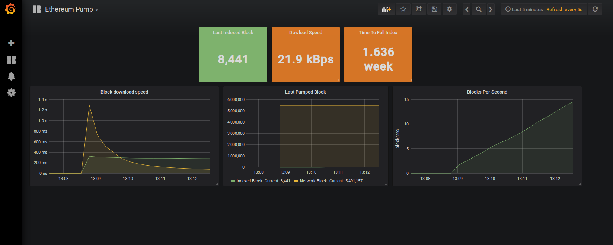
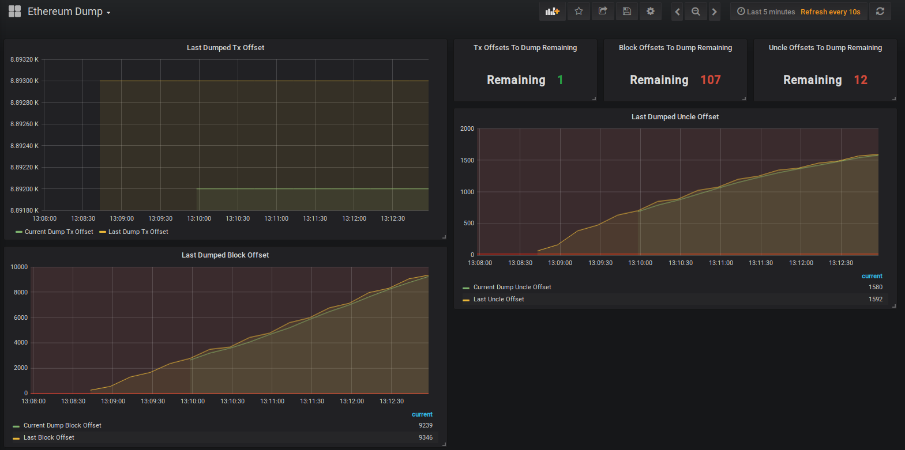
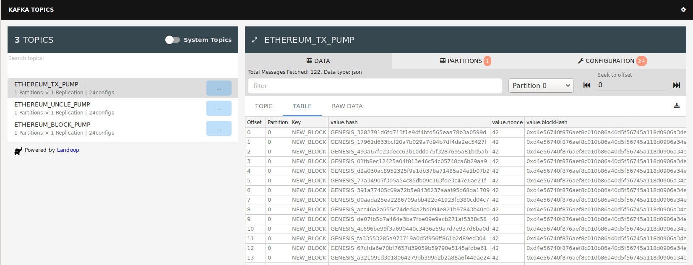
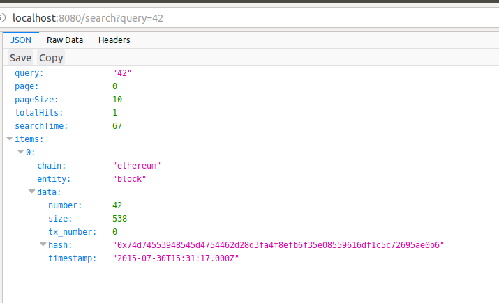

# Ethereum Pump/Dump Demo

This is a demo of Ethereum Pump/Dump. It runs basic search components to demonstrate data workflow.

## Before Run 
Please, change env variable **CHAIN_NODE_URL** of pump component in [**ethereum-demo.yml**](./ethereum-demo.yml) to
 your [Infura](https://infura.io/) url(or, some other external parity url). 
 Note, `localhost` is not permitted due docker dns resolution.
 
## How to Run
To run Ethereum Pump/Dump demo, go to  [demo](.) directory, execute command below and wait for 
 ~1minute(depending on your pc configuration):
```
docker-compose -f ethereum-demo.yml up -d
``` 

## Explore Components
### Monitoring(grafana dashboards)
Open browser, access "localhost:3000". Use default login\ass combination **admin/admin**.
 Here, you can find 2 dashboards: one for Pump, and One for Dump.
 



### Kafka Explorer
On "localhost:3030" endpoint, you can access kafka explorer.



### Search Api

Query api endpoint on `localhost:8080/search?query=42` either via browser or curl



## Stop Containers
```
docker-compose -f ethereum-demo.yml stop
docker-compose -f ethereum-demo.yml rm -f
``` 